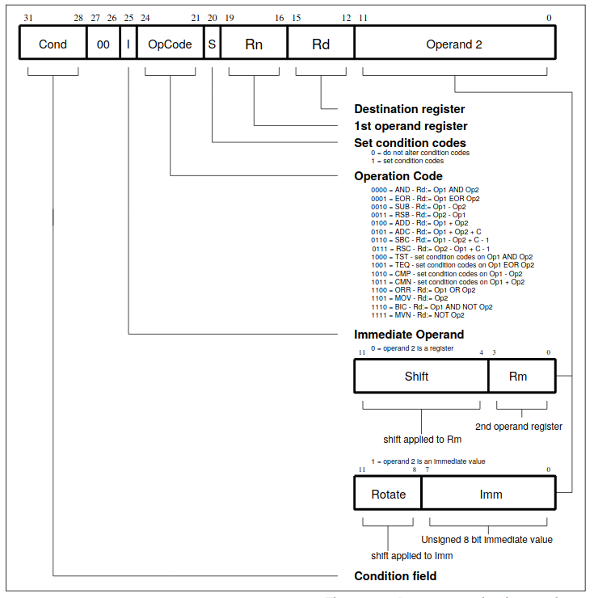

# Introduction
In this part of the course we will take a look at the ARM assembly intruction set and internal arhitecture of the ARM CPU. 

# ARM-32 Registers
For the purposes of the normal programmer in "User Mode" the ARM has 15 registers. R0-R12 are free for us to do whatever we want, R13 is the Stack Pointer (also addressable as SP), R15 is the Program Counter (PC)

R14 may be surprising to those familiar with other CPUs, when we call a subroutine (With BL - Branch and Link) the return address is not pushed onto the stack, instead it's moved into R14/LR... to return from the subroutine we need to move the R14/LR register into R15/PC.

This poses a problem, as nesting subroutines will lose the return value, if this is needed, the best solution is to simply push R14/LR onto the stack at the start of a sub, and pop PC/R15 off the stack at the end.

|	| 	32 Bit registers	|	Use case		|
|---	|	---				|	---			|
|R0	|	R0				|				|
|R1	|	R1				|				|
|R2	|	R2				|				|
|R3	|	R3				|				|
|R4	|	R4				|				|
|R5	|	R5				|				|
|R6	|	R6				|				|
|R7	|	R7				|				|
|R8	|	R8				|				|
|R9	|	R9				|				|
|R10 |	R10				|				|
|R11 |	R11/FP			|Frame Pointer (Optional)				|
|R12 |	R12/IP			|Intra Procedure Call (Optional)		|
|R13 |	SP				|Stack Pointer				|
|R14 |	LR/LK			|Link register		|
|R15 |	PC				|System program counter				|

# ARM Instruction set
## Syntax
General syntax of the ARM instruction is:
```
<op><cc><S> 	Rd, <operands>
```
where:

<ul>
<li> <b>op</b> is ARM instruction </li>
<li> <b>cc</b> is compare flag </li>
<li> <b>S</b>  </li>
<li> <b>Rd</b> destination register </li>
<li> <b>operands</b> arguments for the instruction </li>
</ul>

Following images describes format of the ARM instruction.

## Data processing
### MOV
MOV instruction is used for loading the immediate value to register and for copying value from one register to another. Basic sytanx of the MOV instruction is:
```
mov destination,source
```

<b> Loading the immediate value</b>
```
mov  r0,#0x1234			; load value 0x1234 to register r0 
mov  r1,#56				; load value 56 to register r1
mov  r2,#0x12340000		; this will generate compiler error because we can only load 2 bytes using the MOV instruction
```
<b> Coppying value from one register to another </b>
```
mov r0,pc				; this will coppy value from the PC  to register r0
```
/ref the above image. As we saw before, we can't load to register immediate value greater than 2 bytes.   At least, we can't achive this with only one instruction. But there is workaround. We can use left shift  to get desired value stored in the register. But this value that will be shifted must be stored in the internal register first.


<b> Loading the immediate value larger then 2 bytes</b>
```
mov  r0,#0x1234			; load value 0x1234 to register r0 
mov  r1,r0,LSL 4			; load value 56 to register r1
```
### MVN
This instruction works just like the **MOV** instruction, but instead of loading the provided value to the destination register, this instruction will load first complement of the specified value. For example, instruction
```
mvn r0,#0x00FF
```
will load value *#0xff00* to the register *r0.*
### ADD
Basic sytanx of the ADD instruction is:
```
add 		r0,r1		; r0 = r0 + r1
add 		r0,r0,r1 	; r0= r0 + r1
adc 		r0,r1		; r0 = r0 + r1 + C
```
This instruction will add values from two registers and move them to destination register. We have special case when one of the operands is also the destination register. In this case we can only specify destination register and we don't need to specify second operand because this operans is value from the destination register.

Addin sufix c to this command will take in consideration the value of the carry flag.

### SUB
Basic sytanx of the SUB instruction is:
```
sub 		r0,r1		; r0 = r0 - r1
sub			r0,r0,r1 	; r0= r0 - r1
sbc 		r0,r1		; r0 = r0 - r1 - !C
```
This instruction will add values from two registers and move them to destination register. We have special case when one of the operands is also the destination register. In this case we can only specify destination register and we don't need to specify second operand because this operans is value from the destination register.

Addin sufix c to this command will take in consideration the value of the carry flag.

### RSB
This instruction works just like the SUB instruction. Only differenc is that the position of operans are swapped.
Basic sytanx of the RSB instruction is:
```
rsb 		r0,r1		; r0 = r1 - r0
rsb			r0,r0,r1 		; r0= r1 - r0
```

### Bitwise operation
Following bitwise operations are supported.
```
and 				r0,r1,r2		;r0 = r1 & r2
orr				r0,r1,r2		;r0 = r1 | r2
eor				r0,r1,r2		;r0 = r1 ^ r2
bic 				r0,r1,r2		;r0 = r1 & (~r2)
```

### Comparison operations

## Extending basic instructions

## Flow control
For the flow control we can use following instructions:
```
b <cond> 	label	; jump to the label subroutine
bl <cond> 	label	; coppy address of the next instruction to the LR and jump to the label subroutine
bx<cond>	label	; coppy content of the LR to PC (this is euqal to return from subroutine)
```

